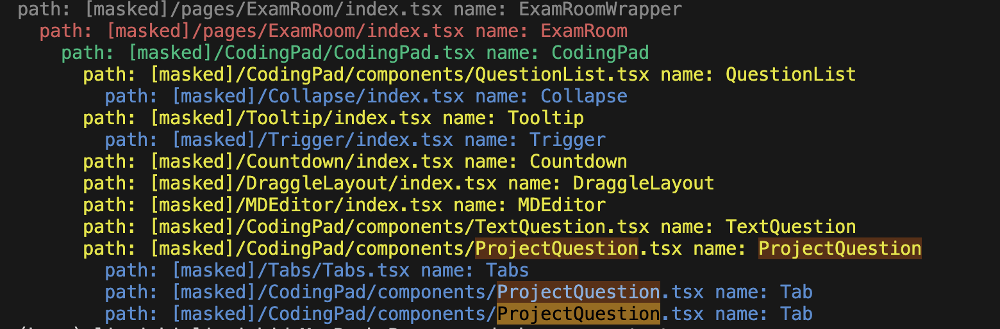

# Scan dumb components

## Abstract

The components in your front-end project are really in a mess, you do not where the component is. So you have to run this script to find relative components.

## Description

```
python main.py path/to/your/tsx
```

It will take the default component as the root, and generate the relations like below:



## Any Suggestions

Please contain wizdaydream@gmail.com or directly message me on Github to improve the repo.